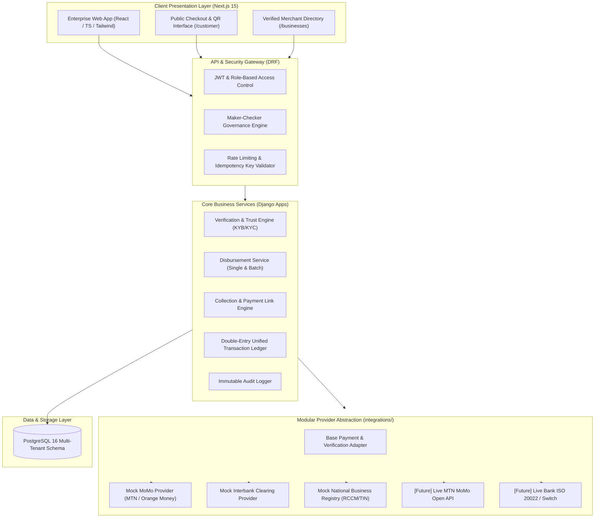
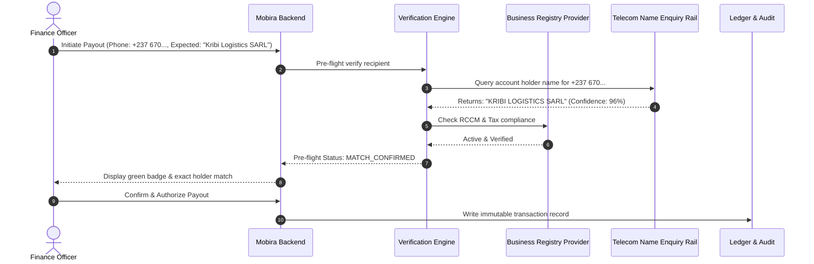

# Mobira System Architecture & Engineering Design

> **Mobira** is a trusted business payment and identity platform built on existing payment infrastructure.
> **PAY • RECEIVE • VERIFY • GROW**
> Mobira is **NOT** a bank, **NOT** a wallet, and **NOT** a replacement for MoMo or banks.

---

## 1. High-Level System Architecture

Mobira serves as the orchestration, verification, and governance layer above legacy and mobile network operator (MNO) payment rails.



---

## 2. Core Pillars & Value Delivery

| Pillar | Capability | Technical Realization |
| :--- | :--- | :--- |
| **PAY** | Single & Bulk Payouts | Idempotent disbursement service, fee simulation, automated retry with backoff, maker-checker dual approval on high-value transfers. |
| **RECEIVE** | Payment Links & Branded QR | Dynamic tokenized links, customizable amount/memo, simulated native MoMo push prompts (USSD STK push), instant webhook settlement. |
| **VERIFY** | Pre-Flight Identity Check | Telecom subscriber name enquiry + National tax/company registry matching before dispatching funds to eliminate ghost vendors and wrong-number losses. |
| **GROW** | Trust Score & Unified Ledger | Algorithmic scoring based on verified documents, successful disbursement velocity, low chargebacks, and automated bank-ready financial statements. |

---

## 3. Modular Provider Abstraction Pattern

The critical architectural decision in Mobira is the **Provider Adapter Pattern**. No business logic directly imports or couples with a specific payment gateway.

```python
# integrations/base/payment_provider.py
from abc import ABC, abstractmethod

class BasePaymentProvider(ABC):
    @abstractmethod
    def disburse(self, request: DisbursementRequest) -> PaymentResult:
        """Disburse funds to a mobile money wallet or bank account."""
        pass

    @abstractmethod
    def collect(self, request: CollectionRequest) -> PaymentResult:
        """Request payment collection from a payer."""
        pass

    @abstractmethod
    def check_status(self, provider_reference: str) -> PaymentResult:
        """Query provider for transaction completion state."""
        pass
```

### Adding Live Rails in the Future
To swap in a live MTN MoMo integration in production:
1. Implement `MTNMoMoProvider(BasePaymentProvider)`.
2. Map MTN API response codes (`SUCCESSFUL`, `FAILED`, `PENDING`) to standard `PaymentResult`.
3. Configure `PAYMENT_PROVIDER=mtn_momo` in environment variables.
4. **Zero lines of application or dashboard code require changing.**

---

## 4. Anti-Fraud Pre-Flight Verification Flow

Before executing any disbursement, Mobira can perform a pre-flight verification:



---

## 5. Security & Governance

1. **Maker-Checker Dual Approval**: Any transaction exceeding `MAKER_CHECKER_THRESHOLD_XAF` (default 500,000 FCFA) requires two distinct authenticated users: one to initiate (Maker) and one to approve (Checker).
2. **PostgreSQL from Day One**: Strong ACID guarantees, foreign key integrity, row-level locking during disbursement processing (`select_for_update`) to eliminate race conditions.
3. **Audit Trails**: Every verification, authorization, status change, and login is recorded in an immutable `audit_log` table with user identity, client IP, and payload snapshot.
4. **Secret Hygiene**: Zero hard-coded credentials; runtime values are loaded exclusively via environment variables and `.gitignore` enforces exclusion.
